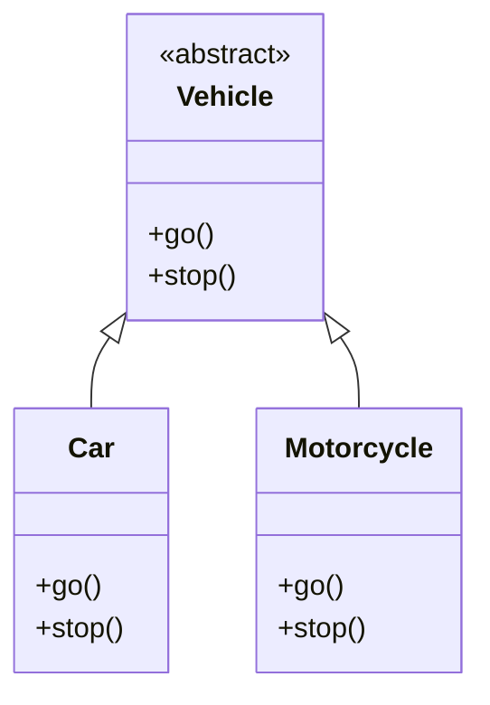

---
cssclasses:
  - cornell-left
  - cornell-border
---
>[!cue] 
>1. What are abstract classes?
>2. How to use them?
>3. What Library is used?
>4. can you create an object from it?
>5. How many children can inherit?
>6. how to declare abstract methods?


>[!summary]
>Abstract Classes are designed to be inherited giving a skeletal structure to it's children classes
>they cannot be instantiated on their own meaning no direct objects related to the Parent Abstract Class, but their children can be.
>Abstract classes can have methods that are essentially empty except the name of the method
>these methods are later filled within the children classes
>**Child** ==must Have== all the methods the **Parent** has


# Abstract Classes (Python)

##  What Is an Abstract Class?

An **Abstract Class** is a class that **cannot be instantiated on its own**  
→ meaning you **cannot create objects from it directly**.

Abstract classes are designed to be **inherited (subclassed)** and act as a **blueprint** for child classes.

They define methods that child classes ==**must**== implement.

Abstract Class is a class that cannot be instantiated on it's own (meaning you can't create objects from it).
1. Prevents instantiation of the class itself.
2. Requires children to use inherited abstract methods.

>[!important] To work with Abstract Classes we need to import ABC meaning Abstract Base Classes.

```python
from abc import ABC, abstractmethod

class Vehicle(ABC):
	
	@abstractmethod#=> we use this decorator to create an abstract method.
	def go(self):
		pass
	@abstractmethod
	def stop(self):
		pass
	
	
```

With abstract methods we declare them but we don't define them in classes instead we will define them in children classes that will inherit from it.
### Notes

- Abstract methods are **declared but not implemented**
- They **must** be implemented in child classes

>[!important] We Can't Create Objects From Abstract Classes

instead we will create children classes to inherit from our abstract class.
```python
from abc import ABC, abstractmethod

class Vehicle(ABC):
	
	@abstractmethod#=> we use this decorator to create an abstract method.
	def go(self):
		pass
	@abstractmethod
	def stop(self):
		pass

class Car(Vehicle):
	def go(self):
		print("Car is going")
		
	def stop(self):
		print("Car is stopping")
	
```

Keep in mind that when the children inherits from an abstract class it also must inherit all the abstract methods.

```python
class Car(Vehicle):
	pass
car = Car()
```
 This will raise an **error** because `go()` and `stop()` are not implemented.

> [!warning]  
> All abstract methods **must** be implemented before instantiation.
Multiple Children can inherit from and abstract class

```python
from abc import ABC, abstractmethod

class Vehicle(ABC):
	
	@abstractmethod#=> we use this decorator to create an abstract method.
	def go(self):
		pass
	@abstractmethod
	def stop(self):
		pass

class Car(Vehicle):
	def go(self):
		print("Car is going")
		
	def stop(self):
		print("Car is stopping")

class Motorcycle(Vehicle):
	def go(self):
		print("Bike is Going")
	def stop(self):
		print("Bike is stopping")
	 
```
- Both `Car` and `Motorcycle` follow the same structure  
- Each provides its own implementation
---

---

```scss
        ┌───────────────────┐
        │     Vehicle       │
        │  (Abstract Class) │
        ├───────────────────┤
        │  + go()           │
        │  + stop()         │
        └─────────▲─────────┘
                  │
        ┌─────────┴─────────┐
        │                   │
┌──────────────┐    ┌────────────────┐
│     Car      │    │  Motorcycle    │
├──────────────┤    ├────────────────┤
│ + go()       │    │ + go()         │
│ + stop()     │    │ + stop()       │
└──────────────┘    └────────────────┘

```

## Important Rule Recap

| Class Type     | Can Create Object? | Must Implement Abstract Methods? |
| -------------- | ------------------ | -------------------------------- |
| Abstract Class | No                 | No                               |
| Child Class    |  Yes               | Yes                              |
it's important to note that we can't create any object from the parent class but from children we can.

## Can Child Classes Have Their Own Methods & Attributes?

**Yes**

Child classes can:
- Have their **own attributes**
- Define **additional methods**
- Use `super()` to access the parent class if needed

> [!tip]  
> Abstract classes only enforce **what must exist**, not **what else you can add**.


