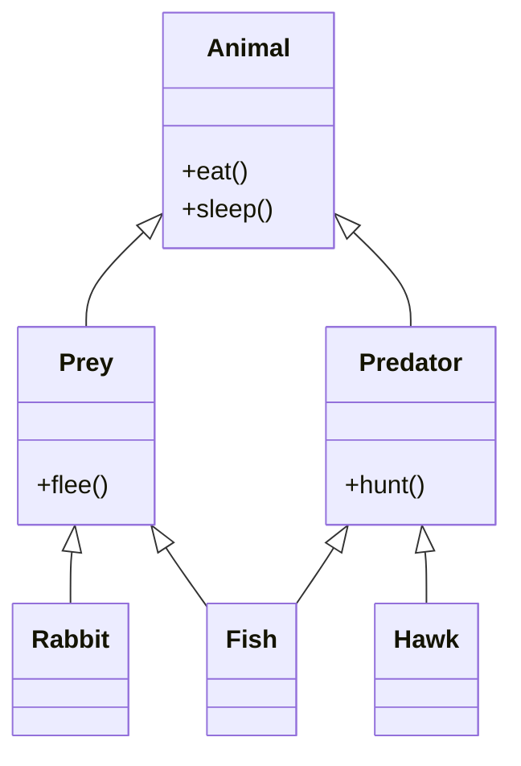

---
cssclasses:
  - cornell-left
  - cornell-border
---

>[!cue]
>1. What is Multiple Inheritance
>2. What is Multilevel Inheritance
>3. Where Should Attributes Go
>4. What is the Hierarchy?


>[!summary]
>==Multiple Inheritance== means a class can have multiple parent classes.
>as is the case with parent child relations the child should inherit both parents methods and attributes.
>==Multi Level Inheritance== means a Child can have a Grandparent meaning the Parent has a Parent so while the Parent inherits from the Grandparent Child inherits from **both**

#python/oop
#inheritance
#multiple-inheritance
#multilevel-inheritance

---
# Multiple Inheritance
---
**Multiple Inheritance** means that a **child class inherits from more than one parent class**.
```python
class Child(ParentA, ParentB):
    pass
```
### Example: Multiple Inheritance
```python
class Prey:#Parent
	def flee(self):
		print("it's fleeing")
class Predator:#Parent
	def hunt(self):
		print("it's hunting")
class Rabbit(Prey):#Children class
	pass
class Hawk(Predator):#Children class
	pass
class Fish(Prey, Predator):#Children class
	pass
```

### Using the Classes

```python
rabbit = Rabbit()
rabbit.flee()
hawk = Hawk()
hawk.hunt()
fish = Fish()
fish.hunt()
fish.flee()
```
#### Key Takeaways

- `Fish` inherits behavior from **both** `Prey` and `Predator`
    
- `Rabbit` only inherits from `Prey`
    
- `Hawk` only inherits from `Predator`
# Multilevel Inheritance
---
**Multilevel Inheritance** occurs when a **parent class inherits from another parent class**, forming a hierarchy.

### Example: Multilevel Inheritance
```python
class Animal:
	def eat(self):
		print("its eating")
	def sleep(self):
		print("it's sleeping")
class Prey(Animal):#Multilevel Inheritance
	def flee(self):
		print("it's fleeing")
class Predator(Animal):#Multilevel Inheritance
	def hunt(self):
		print("it's hunting")
class Rabbit(Prey):#Children class
	pass
class Hawk(Predator):#Children class
	pass
class Fish(Prey, Predator):#Children class
	pass

```
now that we set up a parent for the other parent classes we can see that the children such as fish rabbit or hawk has inherited methods related to the Parent of their parents:

```python
rabbit = Rabbit()
rabbit.flee()
hawk = Hawk()
hawk.hunt()
fish = Fish()
fish.hunt()
fish.flee()
fish.eat()
rabbit.sleep()
```

---

###  What Happened?

- `Animal` is the **top-level (grandparent)** class
    
- `Prey` and `Predator` inherit from `Animal`
    
- Child classes inherit:
    
    - Their **parent’s methods**
        
    - Their **grandparent’s methods**


## Visual Diagram (Multilevel + Multiple):



## Where Should Attributes Go?

> [!important]  
> Attributes should be defined at the **highest level in the hierarchy** where they logically belong.

```nginx
Grandparent → Parent → Child
```


### Example: Attributes at the Top Level

```python
class Animal:

	def __init__(self, name):
		self.name = name
		Animal.is_alive = True

	def eat(self):
		print("its eating")
	def sleep(self):
		print("it's sleeping")
class Prey(Animal):#Multilevel Inheritance
	def flee(self):
		print("it's fleeing")
class Predator(Animal):#Multilevel Inheritance
	def hunt(self):
		print("it's hunting")
class Rabbit(Prey):#Children class
	pass
class Hawk(Predator):#Children class
	pass
class Fish(Prey, Predator):#Children class
	pass
```

```python
rabbit = Rabbit("Bugs Bunny")
rabbit.flee()
print(rabbit.name)
print(rabbit.is_alive)
```


## Constructors & Inheritance

> [!tip]  
> If a child class does **not define its own `__init__()`**, Python will **automatically use the parent’s constructor**.

This means:

- No duplicate constructors needed
    
- Cleaner inheritance
    
- Shared attributes are initialized once
    

---

## Summary Table

|Concept|Description|
|---|---|
|Multiple Inheritance|Child inherits from **multiple parents**|
|Multilevel Inheritance|Parent inherits from another parent|
|Attribute Placement|Put shared attributes in the **highest logical class**|
|Constructors|Parent `__init__()` is used if child has none|
now with other classes if you don't assign any attributes or if you don't need any init logic you don't need a constructor we'll implicitly use the constructor in the parent.